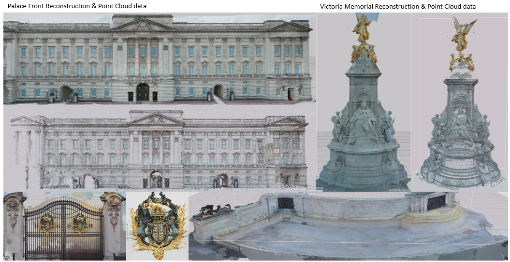
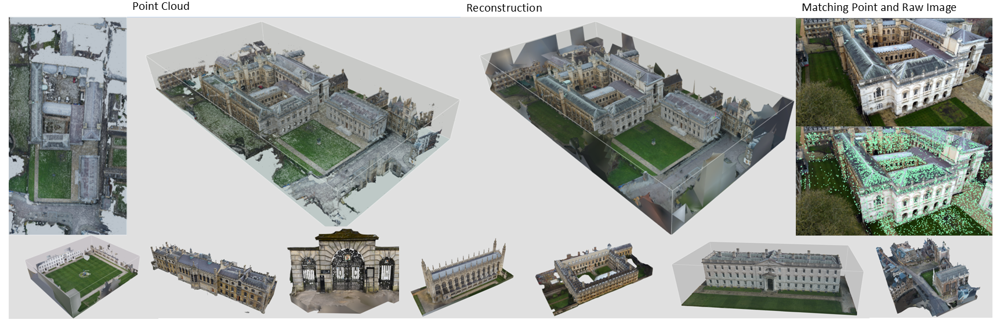
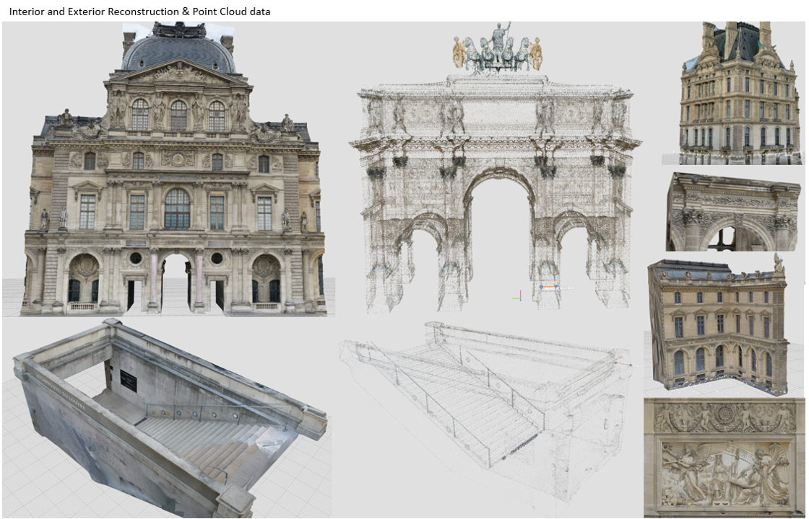
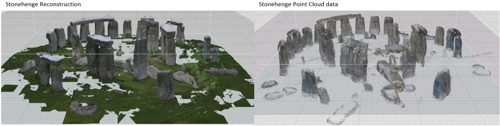
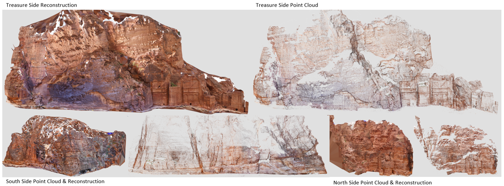
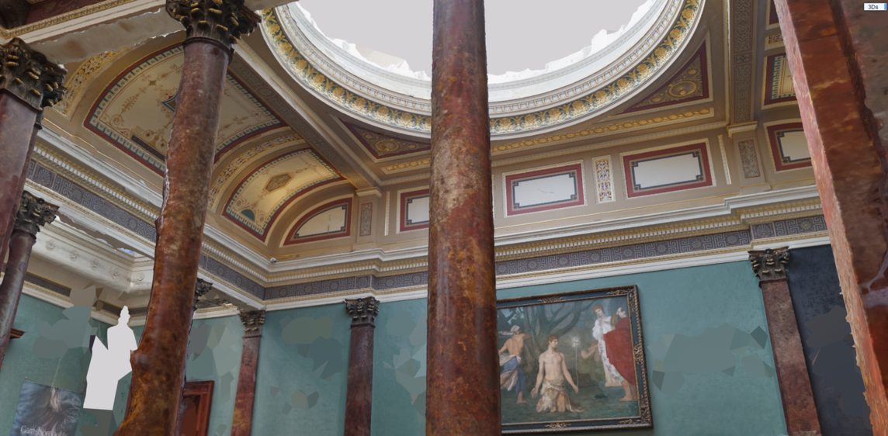
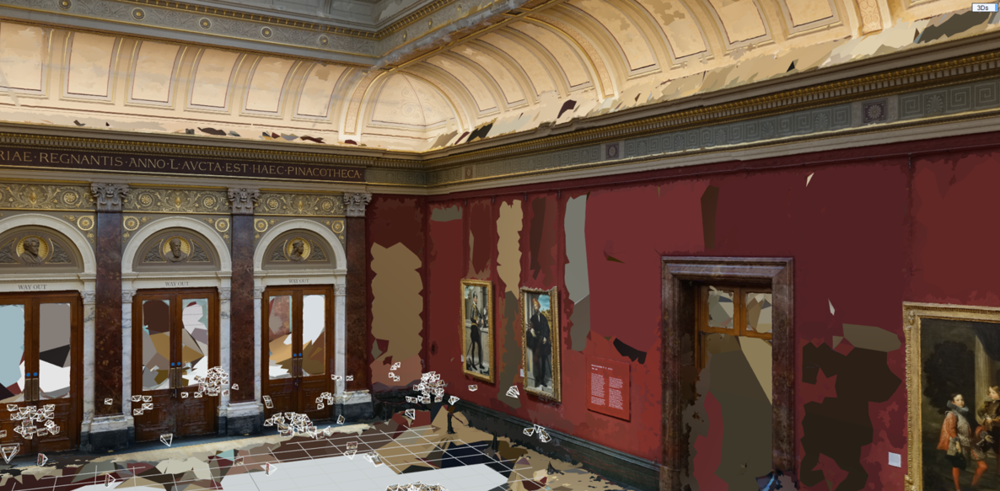
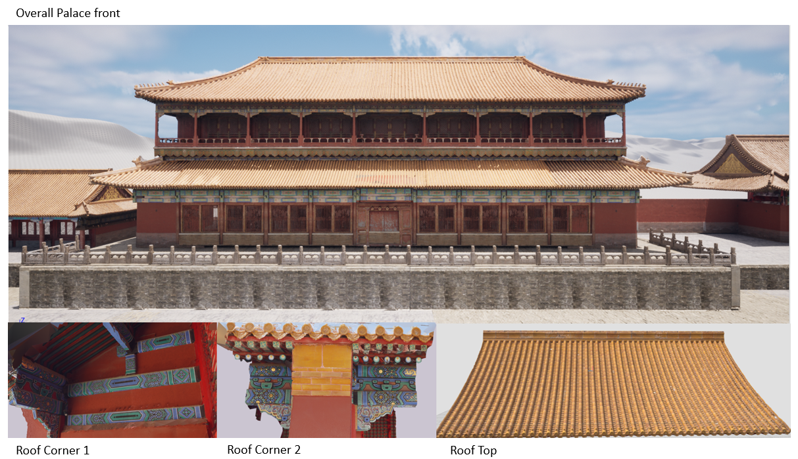
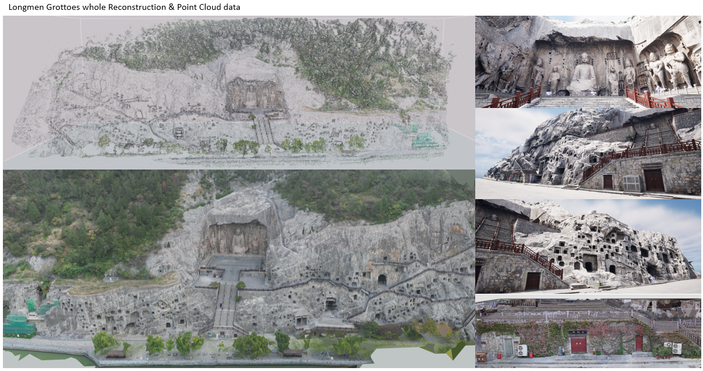

# Large Datasets in 3D

This repository contains a collection of large-scale, fine-grained 3D datasets using high-resolution images captured from various locations worldwide. These datasets support multiple applications, including reconstruction, localization, semantic segmentation, and virtual reality.

## Datasets Overview

We provide datasets for iconic landmarks and cultural heritage sites, each meticulously captured to ensure high accuracy and detail. Below are the available datasets with access links:

1. **[Buckingham Palace Dataset](https://skfb.ly/ptsFD)**  
     
   A detailed reconstruction of Buckingham Palace, emphasizing architectural elements like gates and sculptural decorations.

2. **[Cambridge Campus Dataset](https://skfb.ly/ptsFK)**  
     
   High-resolution modeling of Cambridge University, ideal for urban planning and mixed-reality applications.

3. **[Egyptian Pyramids and Sphinx Dataset](https://skfb.ly/ptsFL)**  
     
   Captures intricate carvings and erosion patterns of these ancient structures.

4. **[Louvre Museum Dataset](https://skfb.ly/ptsFM)**  
     
   Comprehensive exterior depiction of the Louvre Museum with ornate architectural details.

5. **[Leaning Tower of Pisa Dataset](https://skfb.ly/ptsFN)**  
     
   Detailed reconstruction focusing on the unique tilt and masonry of this historic structure.

6. **[Stonehenge Dataset](https://skfb.ly/ptsFP)**  
     
   Captures the iconic rocks with emphasis on spatial arrangement and structural details.

7. **[Petra Dataset](https://skfb.ly/pt9ro)**  
     
   Offers intricate details of natural stone formations and surrounding environments.

8. **[Trafalgar Square Dataset](https://skfb.ly/pt9rF)**  
     
   High-resolution models of statues and surrounding structures within Trafalgar Square.

9. **[National Art Gallery Dataset](https://skfb.ly/pt9sF)**  
     
     
   Captures gallery interiors, including paintings, sculptures, and architectural features.

10. **[Forbidden City Dataset](https://skfb.ly/pt9sR)**  
      
    Detailed depiction of Chinese architectural heritage with intricate carvings and roof patterns.

11. **[Longmen Grottoes Dataset](https://skfb.ly/pt9tr)**  
      
    High-resolution carvings of the Longmen Grottoes, capturing natural weathering effects.

---

## Dataset Format

### Raw Data
- **Images**: High-resolution JPEG images named as `<image_number>.jpg`.
- **Point Cloud Data**: Dense and sparse point clouds in `.ply` and `.pcd` formats.

### Processed Data
- **COLMAP Outputs**: Includes reconstruction data in the COLMAP format.
- **RealityCapture Projects**: Reconstruction results with features such as camera parameters, dense and sparse point clouds, undistorted images, and depth maps.
- **Ground Truth**: TLS (Terrestrial Laser Scanning)-based high-accuracy reconstruction files.

### Virtual Reality Files
Reconstructed VR-ready 3D scenes with high-detail meshes and point clouds.

---

## Applications
- **Reconstruction and Localization**: Benchmarks for SLAM, SfM, and radiance field-based methods like Neural Radiance Fields and Gaussian Splatting.
- **Virtual Reality Integration**: Ready-to-use models for VR applications with high-resolution details.
- **Cultural Preservation**: Enables digital preservation and restoration planning.
- **Research and Training**: Supports training machine learning models for segmentation, reconstruction, and navigation.
